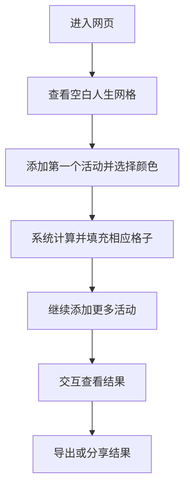
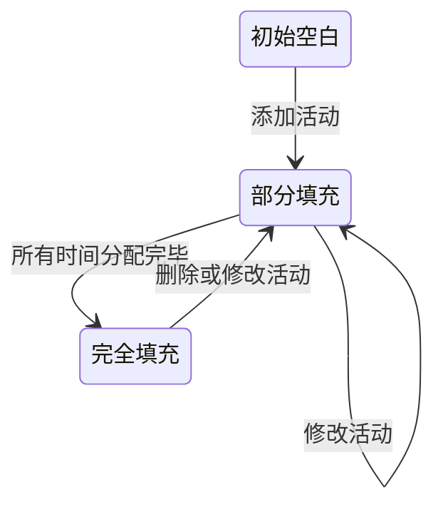
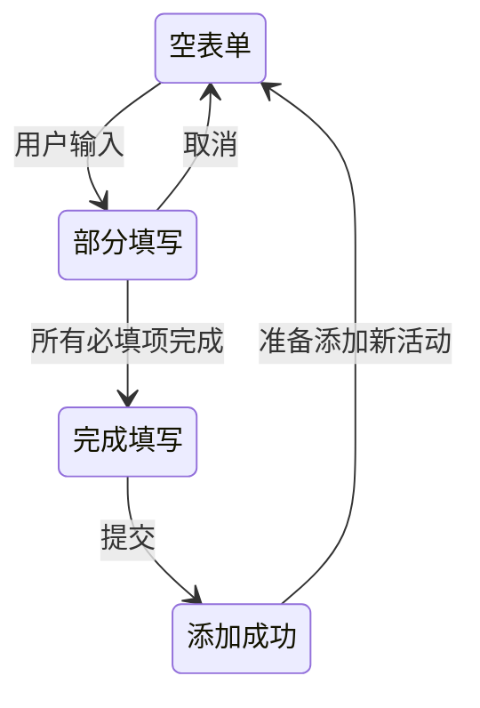
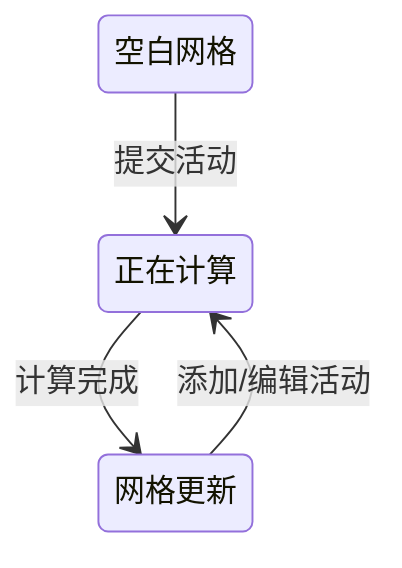
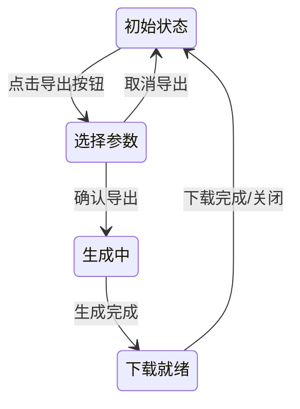

# 人生计算器 - 产品需求文档 (PRD)
**最后更新:** 2025年5月20日

## 1. 文档概览
**版本记录**
| 版本号 | 修改内容 | 修改人 | 日期 |
|--------|----------|--------|------|
| v1.1   | 更新时间单位、颜色方案 | 产品经理 | 2024年3月21日 |
| v1.0   | 初始版本 | 产品经理 | 2024年3月20日 |

## 2. 产品背景与概述

"人生计算器"是一款可视化个人时间分配的Web应用，通过网格化展示人类80年寿命中的每一周，帮助用户直观理解时间分配和生命价值。

**用户痛点:** 
- 人们常常**缺乏对生命时间分配的直观认识**，难以理解自己一生中各项活动实际占用的时间比例
- 调查显示，超过65%的人对自己的时间管理不满意，但缺乏有效工具来直观展示长期时间分配
- 大多数人**无法清晰感知时间的有限性**，导致时间分配与个人价值观不一致
- 传统时间管理工具专注于短期规划，缺乏对整个人生时间维度的宏观展示
- 对重复性活动累积占用的时间缺乏清晰认知
- 难以合理规划和评估生活方式的时间分配

**预期收益:** 
- 帮助用户**直观理解自己一生的时间分配**，增强时间感知
- 促使用户**重新思考生活方式**，更有意识地分配时间
- 提供生活规划和自我反思的视觉化工具
- 激发用户探索更有意义的生活方式和价值取向

**竞品分析:**
| 竞品名称 | 主要功能 | 核心差异点 |
|----------|----------|--------|
| Your Life in Weeks | 以周为单位显示人生网格 | 不支持自定义活动类型，无交互性 |
| TimeVisualizer | 可视化时间分配 | 专注于短期规划，无法展示整个人生 |
| Life Calendar App | 人生日历应用 | 需要下载安装，不支持自定义颜色 |
| WaitButWhy Life Calendar | 纸质人生日历 | 实体产品，不可交互，无法动态更新 |

与传统时间管理工具不同，"人生计算器"不关注具体日程安排，而是提供宏观生命视角，帮助用户重新思考时间的价值和分配，形成更健康的生活方式和习惯。

## 3. 产品框架

**核心功能清单**
| 功能模块 | 功能描述 | 优先级 | AI依赖项 |
|----------|----------|--------|----------|
| 网格展示 | 按80年×52周创建网格，可视化展示一生 | P0 | 无 |
| 活动定义 | 允许用户输入活动名称、时间、频率和颜色 | P0 | 无 |
| 网格着色 | 根据用户输入自动计算并填充相应格子 | P0 | 无 |
| 交互体验 | 悬停高亮同色格子，点击编辑活动 | P1 | 无 |
| 结果导出 | 支持将可视化结果导出分享 | P1 | 无 |
| 活动推荐 | 根据常见生活模式提供模板（可选） | P2 | 可选 |

**用户旅程图**


**技术边界:** 
- **不支持用户账户和数据持久化存储**（仅浏览器本地存储）
- 不提供活动时间记录或提醒功能
- 不包含社交分享功能（仅支持图片导出）
- 不支持跨设备同步
- 不提供统计分析或生成报告功能
- 不支持超过80岁的生命期计算

## 4. 功能详情

### 4.1 可视化生命网格
**功能目标:** 创建直观的人生时间网格，帮助用户理解时间分配的全局视图

- 以网格形式展示80年人生，每年52周，总计4160格
- 支持缩放和当前年龄标记
- 已过去的时间与未来时间有明显区分
- 基于活动显示不同颜色区分

**输入/输出规则:**
| 输入类型 | 数据范围 | 输出类型 | 异常处理 |
|----------|----------|----------|----------|
| 用户年龄（可选） | 0-80岁 | 根据年龄调整网格起点 | 超过80岁时，仍以80岁计算上限 |
| 网格缩放比例 | 25%-200% | 调整后的网格视图 | 超出范围自动设为最近有效值 |

**交互原型:**
```
+----+----+----+----+----+  年份标签
|    |    |    |    |    |  ← 每格代表1周
+----+----+----+----+----+
|    |    |    |    |    |
+----+----+----+----+----+
          ...
+----+----+----+----+----+
|    |    |    |    |    |  ← 一行表示一年的52周
+----+----+----+----+----+
          ...
         (共80行)
```

**状态机定义:**


| 状态 | 描述 | 可转换到的状态 | 触发条件 |
|------|------|----------------|----------|
| 初始空白 | 网格全部为空白 | 部分填充 | 用户添加第一个活动 |
| 部分填充 | 部分格子已着色 | 部分填充, 完全填充 | 添加/修改/删除活动 |
| 完全填充 | 所有格子已分配活动 | 部分填充 | 删除或修改活动 |

### 4.2 活动管理系统
**功能目标:** 允许用户定义生活中的各种活动及其时间分配，构建个性化的人生规划

- 添加、编辑和删除日常活动
- 设置活动频率（每天/每周/每月/每年）
- 指定活动持续时间（小时，精确到小数点后一位）
- 设置活动的生命阶段（起始年龄至结束年龄）
- 自动计算活动占用总周数，直观展示时间分配

**输入/输出规则:**
| 输入类型 | 数据范围 | 输出类型 | 异常处理 |
|----------|----------|----------|----------|
| 活动名称 | 1-20字符 | 文本标签 | 超长自动截断 |
| 时间量 | 0.1-24小时 | 数值 | 超出范围提示错误 |
| 频率单位 | 每天/每周/每月/每年 | 选择项 | 默认为"每天" |
| 年限范围 | 1-80年 | 数值范围 | 超出80自动设为80 |
| 颜色选择 | 30种预设颜色 | 颜色代码 | 默认随机分配 |

**交互原型:**
```
┌─────────────────────────────────────────┐
│ 添加新活动                              │
├─────────────────────────────────────────┤
│ 活动名称: [____________] (如:阅读)      │
│                                         │
│ 花费时间: [____] 小时                   │
│                                         │
│ 频率:  ○每天  ○每周  ○每月  ○每年      │
│                                         │
│ 持续年限: 从第[__]年 到第[__]年         │
│                                         │
│ 颜色选择:                               │
│ ■ ■ ■ ■ ■ ■ ■ ■ ■ ■ ■ ■ ■ ■ ■ ■       │
│ ■ ■ ■ ■ ■ ■ ■ ■ ■ ■ ■ ■ ■ ■ ■ ■       │
│                                         │
│        [取消]        [确认添加]         │
└─────────────────────────────────────────┘
```

**状态机定义:**


| 状态 | 描述 | 可转换到的状态 | 触发条件 |
|------|------|----------------|----------|
| 空表单 | 未填写任何内容 | 部分填写 | 开始输入 |
| 部分填写 | 部分字段已填写 | 完成填写, 空表单 | 填写所有必填项/取消 |
| 完成填写 | 所有必填项已填写 | 添加成功 | 点击确认按钮 |
| 添加成功 | 活动已添加到系统 | 空表单 | 准备添加新活动 |

### 4.3 活动图例与统计
**功能目标:** 自动计算并可视化展示每个活动在人生中占用的时间比例

- 颜色图例显示所有活动及其占比
- 计算并显示活动占用的总周数
- 区分已分配与未分配的时间

**输入/输出规则:**
| 输入类型 | 数据范围 | 输出类型 | 异常处理 |
|----------|----------|----------|----------|
| 活动列表 | 最多100个活动 | 着色网格 | 超出限制提示错误 |
| 颜色配置 | 40种预设颜色 | 颜色填充 | 颜色冲突时自动调整明度 |
| 排序方式 | 按添加顺序/按颜色/按时间量 | 排序后的网格 | 默认按添加顺序 |

**交互原型:**
```
颜色图例:
■ 工作时间 (25周)
■ 睡眠时间 (33周)
■ 学习时间 (10周)
...

┌─────────────────────────────┐
│                             │
│  ■■■■■■■■■■■■■■■■■■■■■■■■■  │ ← 同色格子集中显示
│  ■■■■■■■■■■■■■■■■■■■■■■■■■  │
│  ■■■■■■■■■■■■■■■■■■■■■■■■■  │
│  □□□□□□□□□□□□□□□□□□□□□□□□□  │ ← 未分配时间
│                             │
└─────────────────────────────┘
```

**状态机定义:**


| 状态 | 描述 | 可转换到的状态 | 触发条件 |
|------|------|----------------|----------|
| 空白网格 | 初始无着色状态 | 正在计算 | 用户提交第一个活动 |
| 正在计算 | 系统计算格子分配 | 网格更新 | 计算完成 |
| 网格更新 | 展示最新着色结果 | 正在计算 | 用户添加或编辑活动 |

### 4.4 导出功能
**功能目标:** 允许用户导出可视化结果，便于保存、分享或打印

- 支持PNG/JPG/PDF格式导出
- 定制导出范围（全部生命/自定义年龄段）
- 可选包含活动图例和激励语

**输入/输出规则:**
| 输入类型 | 数据范围 | 输出类型 | 异常处理 |
|----------|----------|----------|----------|
| 导出格式 | PNG/JPG/PDF | 图片或文档文件 | 浏览器不支持时提供备选 |
| 导出范围 | 全部/自定义年份段 | 选定范围的网格 | 范围无效时提示错误 |
| 导出选项 | 包含/不包含说明文字 | 附带说明的图片 | 默认包含说明 |

**交互原型:**
```
┌─────────────────────────────────────────┐
│ 导出我的人生计算结果                    │
├─────────────────────────────────────────┤
│ 格式选择:  ○PNG  ○JPG  ●PDF             │
│                                         │
│ 导出范围:  ●完整人生  ○自定义           │
│           从第[__]年 到第[__]年         │
│                                         │
│ 附加选项:  ☑ 包含活动说明及图例         │
│           ☑ 包含激励语                  │
│                                         │
│           [取消]     [导出]             │
└─────────────────────────────────────────┘

导出结果预览:
┌─────────────────────────────────────────┐
│ 我的人生时间分配                        │
│                                         │
│ [网格可视化内容]                        │
│                                         │
│ ■ 工作 (25周)  ■ 睡眠 (33周)  ■ 阅读 (5周) │
│ ■ 运动 (3周)   ■ 社交 (7周)   ...         │
│                                         │
│ 让你的这一程足够精彩与有意义，          │
│ 我们拭目以待。                          │
└─────────────────────────────────────────┘
```

**状态机定义:**


| 状态 | 描述 | 可转换到的状态 | 触发条件 |
|------|------|----------------|----------|
| 初始状态 | 显示导出按钮 | 选择参数 | 点击导出按钮 |
| 选择参数 | 显示导出选项 | 生成中, 初始状态 | 确认导出/取消导出 |
| 生成中 | 处理导出数据 | 下载就绪 | 生成完成 |
| 下载就绪 | 提供下载链接 | 初始状态 | 下载完成/关闭对话框 |

## 5. 用户价值

1. **时间感知提升**：直观感受生命长度，增强时间宝贵感
2. **决策辅助**：评估活动价值，避免过多时间浪费在低价值事项上
3. **生活规划**：帮助用户重新思考并优化生活方式和时间分配
4. **自我反思**：提供客观视角审视个人习惯和长期行为模式

## 6. 技术实现

1. **前端技术**：原生HTML/CSS/JavaScript，无需框架
2. **数据存储**：使用浏览器localStorage存储用户数据
3. **图形渲染**：Canvas技术实现网格可视化
4. **导出功能**：html2canvas和jsPDF库实现
5. **时间计算**：基于小时单位（精确到小数点后一位）的时间计算系统
6. **颜色系统**：30种高对比度颜色方案，确保视觉区分度

## 7. 全局规则
**术语表**
| 中文术语 | 英文对照 | 描述 |
|----------|----------|------|
| 人生计算器 | Life Calculator | 本产品名称，可视化人生时间分配的工具 |
| 活动 | Activity | 用户定义的生活行为，如工作、睡眠、学习等 |
| 网格 | Grid | 显示人生时间的方格，每格代表一周 |
| 频率 | Frequency | 活动发生的周期，包括每天、每周、每月、每年 |
| 时间占比 | Time Proportion | 特定活动占总时间的百分比或周数 |
| 颜色编码 | Color Coding | 使用30种高对比度颜色区分不同活动的方式 |

**性能标准:** 
- **页面初始加载时间不超过3秒**
- 添加/修改活动后，网格更新时间不超过1秒
- 支持至少50个不同活动的定义和显示
- 导出功能响应时间不超过5秒
- 支持主流浏览器：Chrome、Firefox、Safari、Edge最新版
- 移动设备响应式设计，适配屏幕宽度≥320px的设备

**安全规范:** 
- **所有数据仅在浏览器本地存储**，不上传服务器
- 用户可以手动清除本地存储的数据
- 不收集用户个人信息
- 导出功能不包含任何可识别个人身份的信息
- 不使用第三方追踪脚本或分析工具

## 8. 后续迭代计划

1. **数据同步**：云端存储与多设备同步
2. **模板分享**：预设活动模板与社区分享功能
3. **时间跟踪**：结合实际行为数据，提供时间使用分析
4. **提醒功能**：基于用户时间分配目标提供智能提醒
5. **更多颜色方案**：提供更多自定义颜色选项
6. **数据导入导出**：支持JSON格式的数据导入导出

## 9. 使用说明

1. 设置当前年龄，查看已度过的生命时间
2. 添加各项日常活动及其频率、持续时间
3. 直观查看各活动在生命中的占比
4. 思考并优化个人时间分配
5. 导出个性化生命时间图表，定期反思

## 10. 附录
**测试用例模板**
- [ ] 测试用例1: 添加多个不同频率的活动，验证网格正确着色
- [ ] 测试用例2: 添加时间占比超过100%的活动，验证错误提示
- [ ] 测试用例3: 编辑已有活动，验证网格正确更新
- [ ] 测试用例4: 删除活动，验证网格恢复空白状态
- [ ] 测试用例5: 导出不同格式，验证结果正确可用
- [ ] 测试用例6: 测试响应式布局在不同设备上的表现
- [ ] 测试用例7: 大量活动（>30个）情况下的性能测试
- [ ] 测试用例8: 浏览器刷新后数据恢复测试

**参考文档**
- HTML5 Canvas API: https://developer.mozilla.org/en-US/docs/Web/API/Canvas_API
- LocalStorage API: https://developer.mozilla.org/en-US/docs/Web/API/Window/localStorage
- Export to PDF: https://github.com/parallax/jsPDF
- Color Accessibility Guidelines: https://www.w3.org/WAI/WCAG21/Understanding/use-of-color.html
- Apple Human Interface Guidelines: https://developer.apple.com/design/human-interface-guidelines/ 